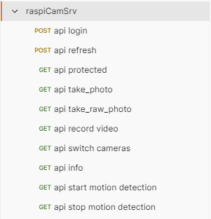
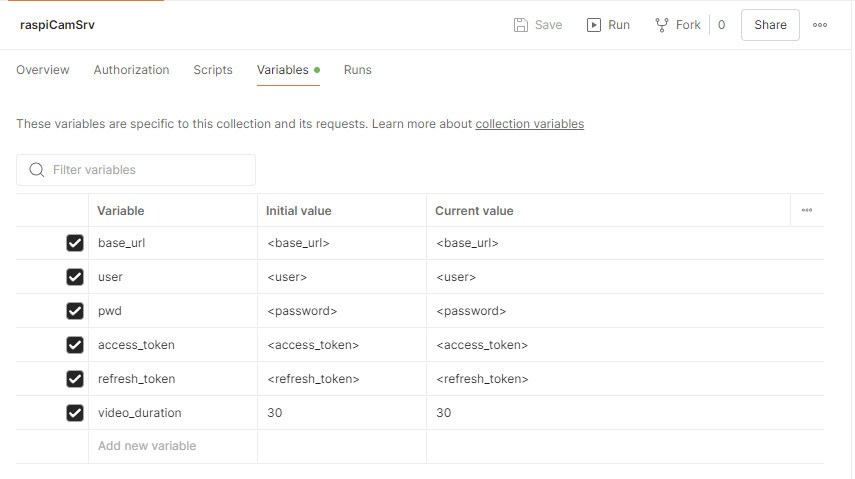

# raspiCamSrv API

[](./UserGuide.md)

The **raspiCamSrv** API allows access to several RaspberryPi camera functions through WebService endpoints.

Configuration of the API is done on the [Settings/API](./SettingsAPI.md) screen.

## Postman Test Collection

For testing the API, a [Postman](https://www.postman.com/) collection is available at [docs/api/postman](https://github.com/signag/raspi-cam-srv/tree/main/docs/api/postman) which can be downloaded and imported into a postman instance.



## API Documentation

The [docs/api/postman](https://github.com/signag/raspi-cam-srv/tree/main/docs/api/postman) folder contains also the [API Documentation](./api/postman/raspiCamSrv.postman_collection.pdf) generated from Postman.

## Variables

The collection uses a set of variables:



```base_url```, ```user``` and ```pwd``` need to be adjusted to the current environment for a user which has been previously created in raspiCamSrv.

```access_token``` and ```refresh_token``` will be automatically filled from responses of the /api/login and /api/refresh endpoints.

## Usage

### 1. Login

Use the ```api login``` request to log in to **raspiCamSrv** and receive an Access Token and a Refresh Token

### 2. Interact with **raspiCamSrv**

Use any of the GET requests to interact with **raspiCamSrv**.

These requests use the Access Token for authentication.

### 3. Refresh the Access Token

If a request returns a expiration error, refresh the Access Token using the ```api refresh``` request.

This will use the Refresh Token for authentication and return a fresh Access Token.


