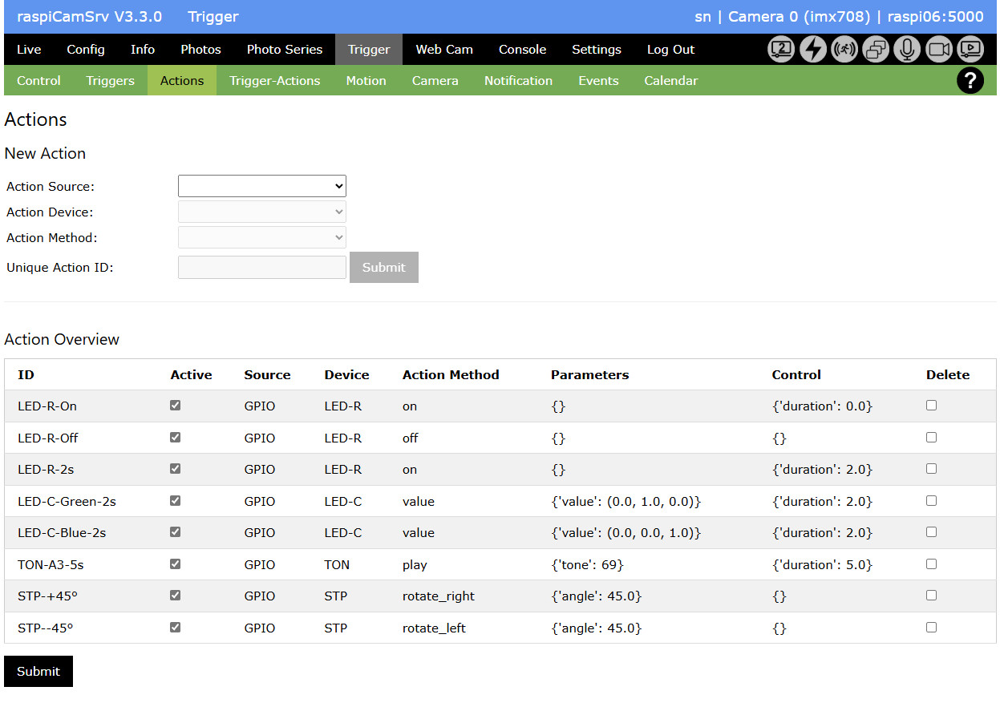
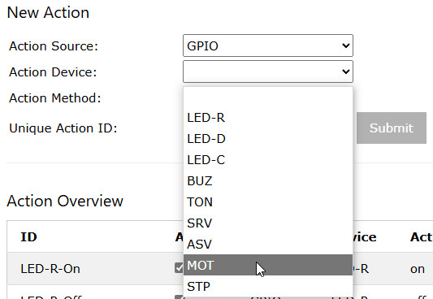

# Actions

This screen is used to specify actions which can be started by **raspiCamSrv**, either as a reaction on a [Trigger](./TriggerTriggers.md) or manually through an [Action Button](./ConsoleActionButtons.md).

**IMPORTANT**: To preserve any configurations over server restart, you need to [store the configuration and activate *Start Server with stored Configuration*](./SettingsConfiguration.md).

## Creating an Action

1. In field *Action Source*, select the source system for which the action is defined:    
 **NOTE**: Camera and SMTP are not yet supported.
2. This will open a list of devices defined for the chosen source system:    
    
For the GPIO system, these are the **Output** devices configured on [Settings/Devices](./SettingsDevices.md)
3. After a device has been selected, the system will show the device type with a link to related gpiozero documentation as well as the action methods which can be executed for this device (this information is taken from the [fixed configuration for the device type](./SettingsDevices.md#device-type-configuration)):    
    
4. When the method has been chosen, the sytem will display any parameters which may be required for this method:    
    
Now you need to specify values for these parameters, unless you leave the defaults, and enter a unique name for the action.    
In this step, the *Submit* button will be activated.    
5. Pressing the *Submit* button will create the action and show it in the *Action Overview*.

### Parameters

The parameters, for which values can be specified, are parameters of the method signature for the device class.    
Information about their type and value range, as well as about their function can be obtained from the *gpiozero* class documentation accessible through the link.

**raspCamSrv** will check the data type by analyzing the datatype of the [configured template](./SettingsDevices.md#device-type-configuration). However, the allowed value range is currently not checked. You need to consult the *gpiozero* documentation.

Sometimes, the 'Action Method' is in fact a property and not a callable method. In this case, **raspiCamSrv** will just assign the value to the property and ignore the parameter name.

### Control

Control parameters are not part of the class interfaces but they can affect how **raspiCamSrv** processes an action method:

- *duration* With duration, you can specify the length of the time interval, during which the device will stay in the state achieved through the method, for example the 'on' state of an LED. After this time, the system will check, whether the device object has a method off() (which is the case for LEDs and Buzzer) or a method stop() (which is the case for Motor and TonalBuzzer). If either of these methods is found, it is applied. In effect, the device will be in an inactive state afterwards.
- *steps* This is the number of steps in which the device shall reach the intended state within the given duration. The intention here is that one might want a smooth rather than an abrupt movement, for example for a Servo. **NOTE**This feature is currently not yet supported.

### Restrictions

At a given time, only one action can be executed on a specific device type.

### Timing of Action Execution

Whereas action execution is synchronous, when invoked through an [Action Button](./ConsoleActionButtons.md) (the user needs to wait until the action is completed), this is different for the case when an action is triggered by a [Trigger](./TriggerTriggers.md).

In the latter case, action execution is done in an own thread which allows the action to be completed independently from the event handling thread which can treat other events in the meantime.

This means that actions are always completed and not interrupted.

This applies to actions with a configured duration, such as an LED which shall be 'on' for a certain time.    
However, it applies also to actions with an inherent time consumtion. For example the movement of a StepperMotor can consist of hundrets of steps with a waiting tyme of 1 to 4 ms after each step. This require in total sever seconds to complete.

If for such an action a new action is requested before the previous action is completed, it will wait until the device is no longer busy.

When stopping the event handling system, **raspiCamSrv** will wait for active actions to complete.

## Activation of Actions

If the event-handling thread is currently active:
- The *Active* check boxes are locked.

If the event-handling thread is not active:
- The *Active* check boxes are active

You can activate/deactivate Actions by changing the *Active* check box and submitting the change.

## Deletion of Actions

You can select one or multiple actions for deletion in the *Delete* column and submit the selection.

The *Delete* column will only be accessible for change if the event-handling thread is currently not active.

You cannot delete an action if it is used in an [Action Button](./SettingsAButtons.md).

When an action is deleted, also its reference in the [Trigger-Actions](./TriggerTriggerActions.md) will be removed.

## Changing Actions

Changing of actions is currently not possible.

However, you can easily create a new similar one with different parameters and deactivate or delete the old one.

