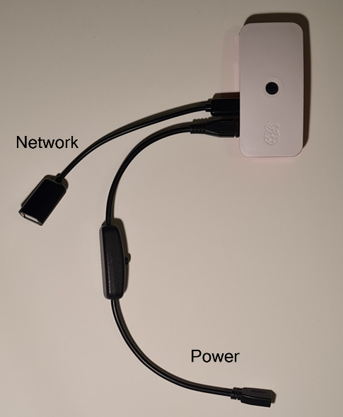

# Setup of Raspberry Pi Zero as Standalone System

[](../README.md)

This section describes how to set up a Raspberry Pi **Zero W** or **Zero 2 W** as standalone system.

This will allow you placing the Raspi camera anywhere, independently from an accessible Wi-Fi.

It will act as hotspot to which you can connect from a mobile client to gain access to **raspiCamSrv**.

The subsequent descriptions can, in principle, also be applied for other Raspberry Pi models.

## Headless Setup

During the setup of such a system, the Raspberry Pi requires a cabled network connection because the Wi-Fi adapter will be configured as hotspot and is, therefore, not available for access by the configuration client.

Connections to a display, keyboard and mouse are not required.



Required [cables and adapters](https://www.raspberrypi.com/products/#power-supplies-and-cables):

- USB A to Ethernet adapter
- Micro USB/Male to USB A/Female cable
- Power supply with Micro USB plug

## 1. Install OS on microSD Card

Follow the instructions for [Install using Imager](https://www.raspberrypi.com/documentation/computers/getting-started.html#raspberry-pi-imager).

- **Model**<br>
Make sure to select the correct model
- **Bullseye or Bookworm?**<br>
raspiCamSrv can be used with both systems.<br>
Whereas there were still some issues for early versions of Bookworm on Pi Zero systems, 
this is no longer the case with the current version.
- **Full or lite system?**<br>
It is recommended to install the full system although the desktop environment will not be required.
- **OS Customisation**<br>
Make sure to *Configure wireless LAN*, although the Wi-Fi Adapter will later not be run in client mode,<br>
however this will assure that the *Wireless LAN Country* will be set.

## 2. Power Up

1. Connect the camera (the small CSI-2 port of Pi Zero and Pi 5 require a special cable)
2. Insert the microSD card into the card slot
3. If available, encapsulate the Pi into a case
4. Connect the network USB cable through an ethernet adapter to a switch of your local network
5. Connect the power supply

## 3. Connect and upgrade

The system may take some time until it is visible within the network.

From a client device connect via SSH<br>

```
ssh <user>@<hostname>

...

sudo apt update
sudo apt full-upgrade
```

## 4. Configure Hotspot

The process of configuration is slightly different, depending on the cosen OS:

- [Hotspot Confiuration for 'Bullseye' OS](./bp_Hotspot_Bullseye.md)
- [Hotspot Confiuration for 'Bookworm' OS](./bp_Hotspot_Bookworm.md)

## 5. Install raspiCamSrv

For installation, you will need to connect through ethernet.

Then, follow the [raspiCamSrv Installation Procedure](../README.md#raspicamsrv-installation)

## 6. Configure raspiCamSrv Sercice

Follow the [Service Configuration](../README.md#service-configuration) instructions

## 7. Test

After rebooting, first test using the client connected with ethernet cable.

If this is successfull, you can shutdown and unplug the ethernet cable

After restart, connect from a mobile client to the hotspot and connect to raspiCamSrv from a browser window.
